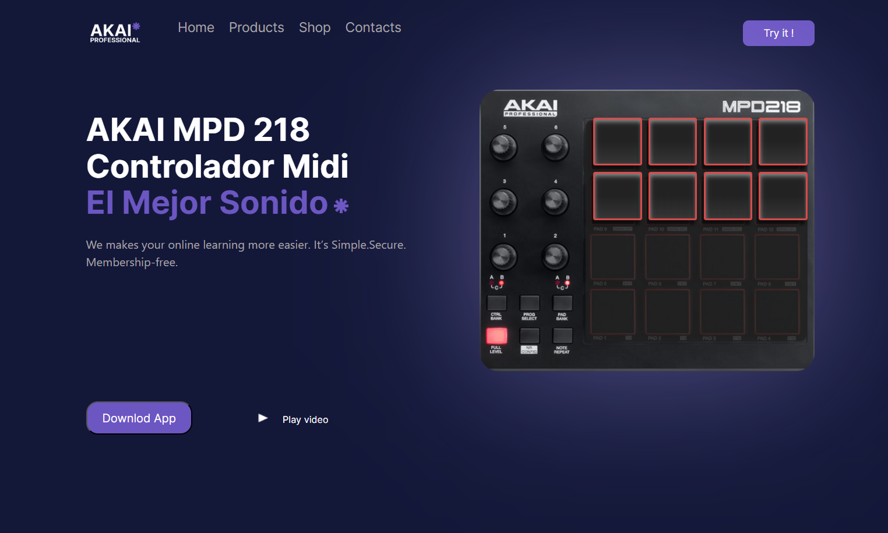
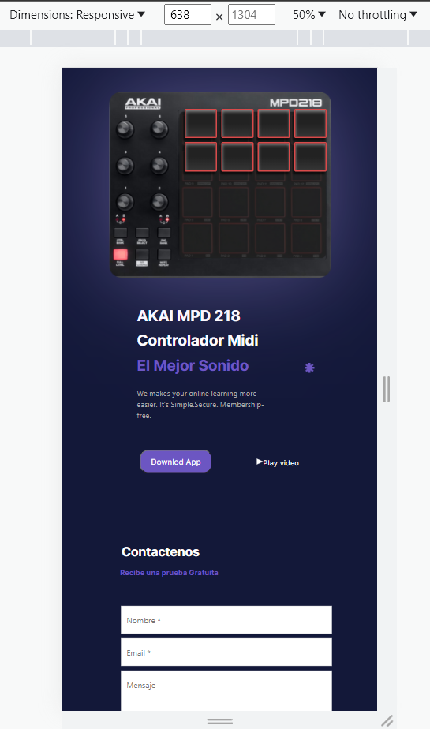

# Hit the DOM - Proyecto

## Descripción

Hit the DOM es una aplicación web que permite controlar dispositivos MIDI, específicamente el controlador AKAI MPD 218. Permite a los usuarios activar diferentes efectos de sonido utilizando los pads del controlador, brindando una experiencia interactiva y entretenida. La aplicación está diseñada para ser amigable para usuarios principiantes y músicos experimentados por igual.

## Vista Previa

## Características
- 📱Diseño responsive
- Efectos de Sonido en Tiempo Real
- Interfaz de Usuario Interactiva
- Diseño Responsivo

### Móvil

## Tecnologías Utilizadas

- HTML
- CSS
- JavaScript
- Bootstrap 5
- Figma (para prototipos de diseño)

## Diseño

El diseño de Hit the DOM fue creado utilizando Figma, una poderosa herramienta de prototipado de diseño. El objetivo fue crear una interfaz de usuario intuitiva y visualmente atractiva que mejorara la experiencia general del usuario. La paleta de colores, el diseño y los gráficos fueron seleccionados cuidadosamente para estar en línea con el tema y la identidad visual de la aplicación.

## Empezando

Para ejecutar la aplicación web de Hit the DOM localmente, sigue estos pasos:

1. Clona este repositorio en tu máquina local utilizando git clone https://github.com/Irina-Ichim/hit-the-dom-only-me.git
2. Abre el archivo index.html en tu navegador web.
3. Comienza a jugar con los efectos de sonido y explora las características.

## Agradecimientos

Quisiera expresar mi agradecimiento a mi profesor, Carlos 

